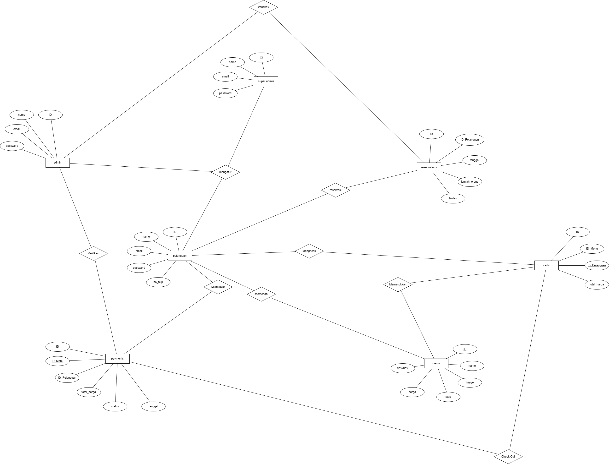
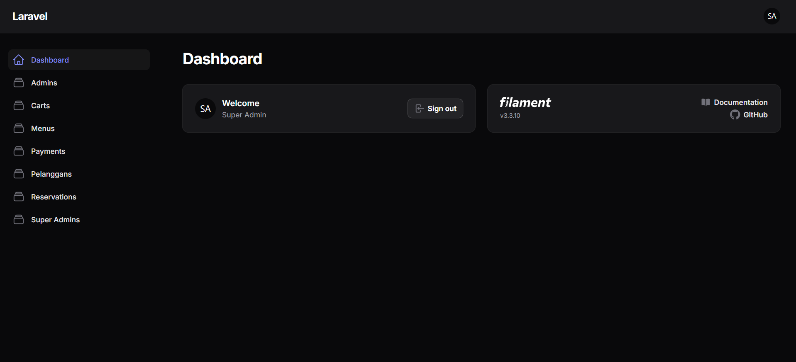
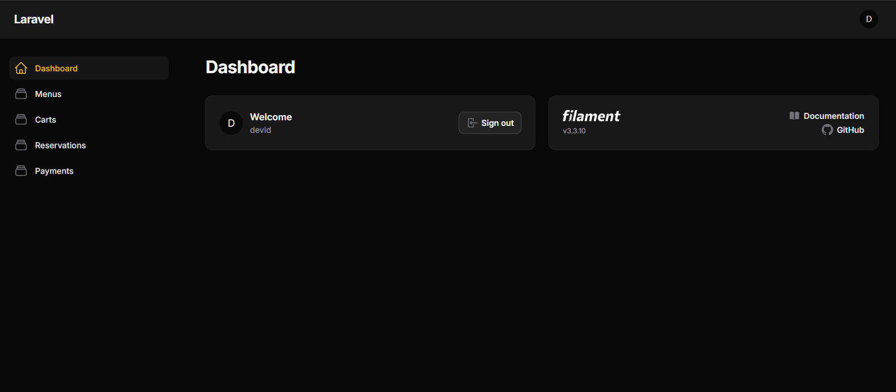

# Laporan Progres Mingguan - SORA
**Kelompok**: 6

**Mitra**: Rumah Makan Salwa

**Pekan ke-**: 10

**Tanggal**: 18/04/2025

---
## Anggota Kelompok ##

- **Amazia Devid Saputra dengan NIM 10231013** 
- **Dyno Fadillah Ramadhani dengan NIM 10231033**
- **Rani Ayu Dewi dengan NIM 10231079**
- **Siti Nur Azizah Putri Awni dengan NIM 10231087**

---

## Progress Summary
Minggu ini tim telah berhasil membuat Entity Relationship Diagram (ERD) untuk sistem yang mencakup 7 entitas utama (super_admin, admin, pelanggan, menus, reservations, payments, cart). Implementasi backend menggunakan Laravel dengan endpoint dasar untuk autentikasi dan manajemen menu telah selesai dibuat. Struktur frontend dengan React dan React Router juga telah diimplementasikan termasuk komponen Layout, halaman Login, dan sistem routing dasar.

## Accomplished Tasks
- Membuat Entity Relationship Diagram (ERD) dengan 7 entitas utama dan relasi antar tabelnya
- Mengimplementasikan backend skeleton dengan Laravel termasuk AuthController dan MenuController
- Membuat struktur routing API dengan endpoint untuk auth, menu, reservasi dan cart
- Mengimplementasikan frontend skeleton dengan React dan React Router
- Membuat komponen Layout utama dengan navigasi dan footer
- Mengimplementasikan halaman Login dengan form validasi dan state management

## Challenges & Solutions
- **Challenge 1**: Kompleksitas Relasi Database
    - **Solution**: Membuat ERD yang terstruktur dengan 7 entitas utama (super_admin, admin, pelanggan, menus, reservations, payments, cart) dan mendefinisikan relasi one-to-many yang jelas antar tabel

- **Challenge 2**: Implementasi Autentikasi Multi-User
    - **Solution**: Menggunakan Laravel Sanctum untuk authentication dan membuat AuthController dengan validasi yang robust untuk register dan login

- **Challenge 3**: Frontend State Management
    - **Solution**: Implementasi sistem routing dengan React Router dan state management untuk autentikasi user menggunakan localStorage

## Next Week Plan
- Sistem Autentikasi: Login/Register/Logout
- Core Feature #1: Fitur utama pertama sesuai kebutuhan mitra
- Integration Test: Bukti pengujian integrasi

## Contributions
- **Amazia Devid Saputra**: Membantu membuat laporan (md), membuat struktur frontend
- **Dyno Fadillah Ramadhani**: Membantu membuat laporan (md), membuat struktur ERD, membuat struktur backend, dan halaman backend
- **Rani Ayu Dewi**: Membantu membuat laporan (md), membuat tampilan frontend
- **Siti Nur Azizah Putri Awni**: Membantu membuat laporan (md), membuat database pada PostgreSQL

## Screenshots / Demo
## 1. ERD (Entity Relationship Diagram)


### Penjelasan ERD:

**Entitas:**
1. **super_admin**
   - Atribut: id, name, email, password, created_at, updated_at
   - Super admin memiliki akses penuh ke semua fitur

2. **admin**
   - Atribut: id, name, email, password, created_at, updated_at
   - Admin dapat mengelola menu, reservasi, dan pembayaran

3. **pelanggan**
   - Atribut: id, name, email, password, no_telepon, created_at, updated_at
   - Pelanggan dapat melakukan pemesanan menu, reservasi, dan pembayaran

4. **menus**
   - Atribut: id, name, price, gambar, stok, desc, created_at, updated_at
   - Berisi daftar menu makanan dan minuman

5. **reservations**
   - Atribut: id, pelanggan_id, tanggal, waktu, jumlah_orang, note, created_at, updated_at
   - Menyimpan informasi reservasi yang dibuat oleh pelanggan

6. **payments**
   - Atribut: id, pelanggan_id, bank, no_bank, total_price, created_at, updated_at
   - Menyimpan data pembayaran yang dilakukan oleh pelanggan

7. **cart**
   - Atribut: id, pelanggan_id, menus_id, total_price, created_at, updated_at
   - Keranjang belanja untuk menyimpan menu yang dipilih pelanggan

**Relasi:**
- Pelanggan **memiliki banyak** Reservasi (one-to-many)
- Pelanggan **memiliki banyak** Payment (one-to-many)
- Pelanggan **memiliki banyak** Cart (one-to-many)
- Menu **memiliki banyak** Cart (one-to-many)

---

## 2. Backend Skeleton (Endpoint Dasar)

Saya telah mengimplementasikan beberapa endpoint REST API dasar menggunakan Laravel. Berikut adalah beberapa endpoint yang sudah berfungsi:

### Halaman Dashboard SuperAdmin


### Halaman Dashboard Admin


### Controller Auth

```php
// AuthController.php
public function register(Request $request)
{
    $validator = Validator::make($request->all(), [
        'name' => 'required|string|max:255',
        'email' => 'required|string|email|max:255|unique:pelanggan',
        'password' => 'required|string|min:8',
        'no_telepon' => 'required|string|max:15',
    ]);

    if ($validator->fails()) {
        return response()->json([
            'message' => 'Validation error',
            'errors' => $validator->errors()
        ], 422);
    }

    $user = Pelanggan::create([
        'name' => $request->name,
        'email' => $request->email,
        'password' => Hash::make($request->password),
        'no_telepon' => $request->no_telepon,
    ]);

    $token = $user->createToken('auth_token')->plainTextToken;

    return response()->json([
        'message' => 'Registration successful',
        'user' => $user,
        'access_token' => $token,
        'token_type' => 'Bearer',
    ], 201);
}

public function login(Request $request)
{
    $validator = Validator::make($request->all(), [
        'email' => 'required|string|email',
        'password' => 'required|string',
    ]);

    if ($validator->fails()) {
        return response()->json([
            'message' => 'Validation error',
            'errors' => $validator->errors()
        ], 422);
    }

    if (!Auth::guard('web')->attempt($request->only('email', 'password'))) {
        return response()->json([
            'message' => 'Invalid login credentials',
        ], 401);
    }

    $user = Pelanggan::where('email', $request->email)->first();
    $token = $user->createToken('auth_token')->plainTextToken;

    return response()->json([
        'message' => 'Login successful',
        'user' => $user,
        'access_token' => $token,
        'token_type' => 'Bearer',
    ]);
}
```

### Controller Menu

```php
// MenuController.php
public function index()
{
    $menus = Menu::all();
    return response()->json([
        'success' => true,
        'data' => $menus
    ]);
}

public function show($id)
{
    $menu = Menu::find($id);
    
    if (!$menu) {
        return response()->json([
            'success' => false,
            'message' => 'Menu not found'
        ], 404);
    }

    return response()->json([
        'success' => true,
        'data' => $menu
    ]);
}

public function store(Request $request)
{
    $validator = Validator::make($request->all(), [
        'name' => 'required|string|max:255',
        'price' => 'required|numeric',
        'stok' => 'required|integer',
        'desc' => 'nullable|string',
        'gambar' => 'nullable|image|mimes:jpeg,png,jpg,gif|max:2048',
    ]);

    if ($validator->fails()) {
        return response()->json([
            'success' => false,
            'message' => 'Validation error',
            'errors' => $validator->errors()
        ], 422);
    }

    $data = $request->all();
    
    if ($request->hasFile('gambar')) {
        $file = $request->file('gambar');
        $filename = time() . '.' . $file->getClientOriginalExtension();
        $file->move(public_path('uploads/menus'), $filename);
        $data['gambar'] = 'uploads/menus/' . $filename;
    }

    $menu = Menu::create($data);

    return response()->json([
        'success' => true,
        'message' => 'Menu created successfully',
        'data' => $menu
    ], 201);
}
```

### API Routes

```php
// api.php
// Auth Routes
Route::post('/register', [AuthController::class, 'register']);
Route::post('/login', [AuthController::class, 'login']);

// Public Routes
Route::get('/menus', [MenuController::class, 'index']);
Route::get('/menus/{id}', [MenuController::class, 'show']);

// Protected Routes
Route::middleware('auth:sanctum')->group(function () {
    Route::post('/logout', [AuthController::class, 'logout']);
    Route::get('/profile', [AuthController::class, 'user']);
    
    // Menu Routes (Admin Only)
    Route::post('/menus', [MenuController::class, 'store']);
    Route::put('/menus/{id}', [MenuController::class, 'update']);
    Route::delete('/menus/{id}', [MenuController::class, 'destroy']);
    
    // Reservation Routes
    Route::get('/reservations', [ReservationController::class, 'index']);
    Route::post('/reservations', [ReservationController::class, 'store']);
    
    // Cart Routes
    Route::get('/user/{userId}/cart', [CartController::class, 'userCart']);
    Route::post('/cart', [CartController::class, 'store']);
});
```

---

## 3. Frontend Skeleton (React dengan Routing)

Saya telah mengimplementasikan struktur dasar frontend menggunakan React dengan React Router untuk menangani navigasi.

### Struktur Frontend

```
resources/js/
├── Components/
│   └── Layout.jsx            # Layout utama aplikasi
├── Pages/
│   ├── Auth/
│   │   ├── Login.jsx         # Halaman login
│   │   └── Register.jsx      # Halaman registrasi
│   ├── Menu/
│   │   └── MenuList.jsx      # Halaman daftar menu
│   └── Home/
│       └── Home.jsx          # Halaman beranda
└── App.jsx                   # Komponen utama dengan setup routing
```

### Implementasi Router (App.jsx)

```jsx
import React from 'react';
import { BrowserRouter as Router, Routes, Route } from 'react-router-dom';
import Home from './Pages/Home/Home';
import Login from './Pages/Auth/Login';
import Register from './Pages/Auth/Register';
import MenuList from './Pages/Menu/MenuList';
import PrivateRoute from './Components/PrivateRoute';

const App = () => {
    return (
        <Router>
            <Routes>
                <Route path="/" element={<Home />} />
                <Route path="/login" element={<Login />} />
                <Route path="/register" element={<Register />} />
                <Route path="/menu" element={<MenuList />} />
                
                {/* Protected routes */}
                <Route path="/cart" element={
                    <PrivateRoute>
                        <Cart />
                    </PrivateRoute>
                } />
                <Route path="/reservation" element={
                    <PrivateRoute>
                        <ReservationForm />
                    </PrivateRoute>
                } />
            </Routes>
        </Router>
    );
};

export default App;
```

### Implementasi Components/Layout.jsx

```jsx
import React, { useState } from 'react';
import { Link, useNavigate } from 'react-router-dom';
import axios from 'axios';

const Layout = ({ children }) => {
    const [isMenuOpen, setIsMenuOpen] = useState(false);
    const navigate = useNavigate();
    const user = JSON.parse(localStorage.getItem('user'));
    const token = localStorage.getItem('token');

    const handleLogout = async () => {
        try {
            await axios.post('/api/logout', {}, {
                headers: {
                    Authorization: `Bearer ${token}`
                }
            });
            localStorage.removeItem('user');
            localStorage.removeItem('token');
            navigate('/login');
        } catch (error) {
            console.error('Logout failed', error);
        }
    };

    return (
        <div className="min-h-screen bg-gray-100">
            {/* Navigation */}
            <nav className="bg-white shadow-sm">
                <div className="max-w-7xl mx-auto px-4 sm:px-6 lg:px-8">
                    <div className="flex justify-between h-16">
                        <div className="flex">
                            <div className="flex-shrink-0 flex items-center">
                                <Link to="/" className="text-2xl font-bold text-indigo-600">SORA</Link>
                            </div>
                            <div className="hidden sm:ml-6 sm:flex sm:space-x-8">
                                <Link to="/" className="border-indigo-500 text-gray-900 inline-flex items-center px-1 pt-1 border-b-2 text-sm font-medium">
                                    Home
                                </Link>
                                <Link to="/menu" className="border-transparent text-gray-500 hover:border-gray-300 hover:text-gray-700 inline-flex items-center px-1 pt-1 border-b-2 text-sm font-medium">
                                    Menu
                                </Link>
                                <Link to="/reservation" className="border-transparent text-gray-500 hover:border-gray-300 hover:text-gray-700 inline-flex items-center px-1 pt-1 border-b-2 text-sm font-medium">
                                    Reservation
                                </Link>
                            </div>
                        </div>
                        <div className="hidden sm:ml-6 sm:flex sm:items-center">
                            {user ? (
                                <div className="flex items-center space-x-4">
                                    <Link to="/cart" className="text-gray-500 hover:text-gray-700">
                                        <svg xmlns="http://www.w3.org/2000/svg" className="h-6 w-6" fill="none" viewBox="0 0 24 24" stroke="currentColor">
                                            <path strokeLinecap="round" strokeLinejoin="round" strokeWidth={2} d="M3 3h2l.4 2M7 13h10l4-8H5.4M7 13L5.4 5M7 13l-2.293 2.293c-.63.63-.184 1.707.707 1.707H17m0 0a2 2 0 100 4 2 2 0 000-4zm-8 2a2 2 0 11-4 0 2 2 0 014 0z" />
                                        </svg>
                                    </Link>
                                    <button onClick={handleLogout}>
                                        Logout
                                    </button>
                                </div>
                            ) : (
                                <div className="flex items-center space-x-4">
                                    <Link to="/login" className="text-gray-500 hover:text-gray-700 px-3 py-2 rounded-md text-sm font-medium">Login</Link>
                                    <Link to="/register" className="bg-indigo-600 text-white hover:bg-indigo-700 px-3 py-2 rounded-md text-sm font-medium">Register</Link>
                                </div>
                            )}
                        </div>
                    </div>
                </div>
            </nav>

            {/* Main content */}
            <main className="py-10">
                <div className="max-w-7xl mx-auto sm:px-6 lg:px-8">
                    {children}
                </div>
            </main>

            {/* Footer */}
            <footer className="bg-white">
                <div className="max-w-7xl mx-auto py-12 px-4 sm:px-6 lg:px-8">
                    <div className="border-t border-gray-200 pt-8 md:flex md:items-center md:justify-between">
                        <div className="mt-8 md:mt-0">
                            <p className="text-base text-gray-400">&copy; 2024 SORA. All rights reserved.</p>
                        </div>
                    </div>
                </div>
            </footer>
        </div>
    );
};

export default Layout;
```

### Implementasi Pages/Auth/Login.jsx

```jsx
import React, { useState } from 'react';
import { Link, useNavigate } from 'react-router-dom';
import axios from 'axios';
import Layout from '../../Components/Layout';

const Login = () => {
    const [formData, setFormData] = useState({
        email: '',
        password: '',
    });
    const [errors, setErrors] = useState({});
    const [isLoading, setIsLoading] = useState(false);
    const navigate = useNavigate();

    const handleChange = (e) => {
        setFormData({
            ...formData,
            [e.target.name]: e.target.value,
        });
    };

    const handleSubmit = async (e) => {
        e.preventDefault();
        setIsLoading(true);
        setErrors({});

        try {
            const response = await axios.post('/api/login', formData);
            localStorage.setItem('token', response.data.access_token);
            localStorage.setItem('user', JSON.stringify(response.data.user));
            navigate('/');
        } catch (error) {
            console.error('Login error:', error);
            if (error.response?.data?.errors) {
                setErrors(error.response.data.errors);
            } else if (error.response?.data?.message) {
                setErrors({ general: error.response.data.message });
            } else {
                setErrors({ general: 'Something went wrong. Please try again.' });
            }
        } finally {
            setIsLoading(false);
        }
    };

    return (
        <Layout>
            <div className="flex justify-center">
                <div className="w-full max-w-md">
                    <h2 className="text-center text-3xl font-bold mb-6">Login</h2>
                    <form onSubmit={handleSubmit} className="bg-white shadow-md rounded px-8 pt-6 pb-8 mb-4">
                        {errors.general && (
                            <div className="bg-red-100 border border-red-400 text-red-700 px-4 py-3 rounded mb-4">
                                {errors.general}
                            </div>
                        )}
                        <div className="mb-4">
                            <label className="block text-gray-700 text-sm font-bold mb-2" htmlFor="email">
                                Email
                            </label>
                            <input
                                className="shadow appearance-none border rounded w-full py-2 px-3 text-gray-700 leading-tight focus:outline-none focus:shadow-outline"
                                id="email"
                                type="email"
                                name="email"
                                value={formData.email}
                                onChange={handleChange}
                                placeholder="Email"
                                required
                            />
                            {errors.email && <p className="text-red-500 text-xs italic">{errors.email}</p>}
                        </div>
                        <div className="mb-6">
                            <label className="block text-gray-700 text-sm font-bold mb-2" htmlFor="password">
                                Password
                            </label>
                            <input
                                className="shadow appearance-none border rounded w-full py-2 px-3 text-gray-700 mb-3 leading-tight focus:outline-none focus:shadow-outline"
                                id="password"
                                type="password"
                                name="password"
                                value={formData.password}
                                onChange={handleChange}
                                placeholder="******************"
                                required
                            />
                            {errors.password && <p className="text-red-500 text-xs italic">{errors.password}</p>}
                        </div>
                        <div className="flex items-center justify-between">
                            <button
                                className="bg-blue-500 hover:bg-blue-700 text-white font-bold py-2 px-4 rounded focus:outline-none focus:shadow-outline"
                                type="submit"
                                disabled={isLoading}
                            >
                                {isLoading ? 'Loading...' : 'Sign In'}
                            </button>
                            <Link
                                className="inline-block align-baseline font-bold text-sm text-blue-500 hover:text-blue-800"
                                to="/register"
                            >
                                Register
                            </Link>
                        </div>
                    </form>
                </div>
            </div>
        </Layout>
    );
};

export default Login;
```


---

Link Github Repository untuk website : https://github.com/brosora6/sora.git

Link Github Repository untuk Laporan : https://github.com/justdyn/laporan_proweb.git