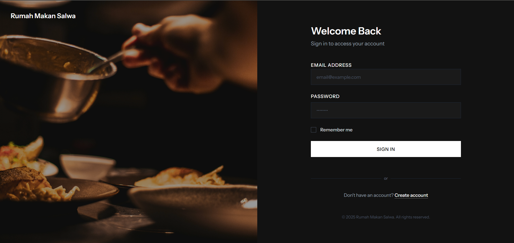
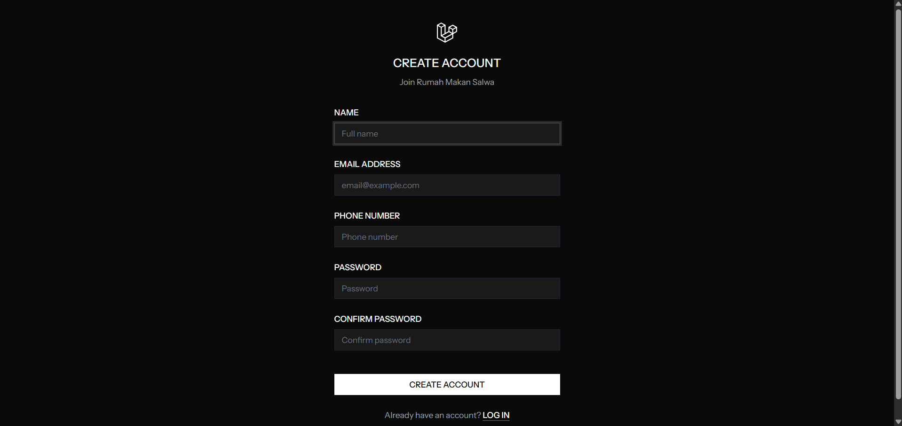
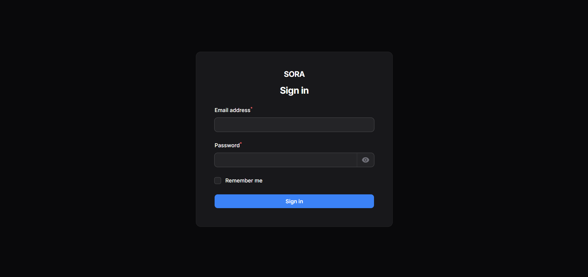
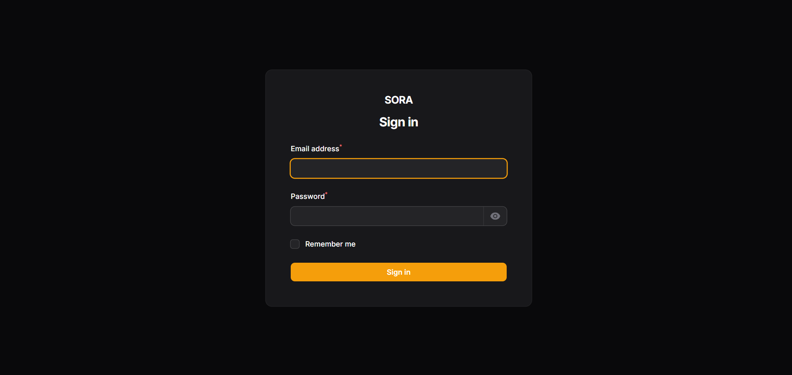
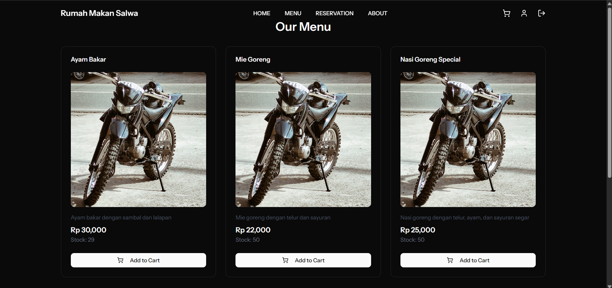

# Laporan Progres Mingguan - SORA
**Kelompok** : 6

**Mitra** : Rumah Makan Salwa

**Pekan ke -** : 11

**Tanggal** : 22/04/2025

---
## Anggota Kelompok ##

- **Amazia Devid Saputra dengan NIM 10231013** 
- **Dyno Fadillah Ramadhani dengan NIM 10231033**
- **Rani Ayu Dewi dengan NIM 10231079**
- **Siti Nur Azizah Putri Awni dengan NIM 10231087**

---

## Progress Summary
Minggu ini tim telah berhasil mengimplementasikan sistem manajemen restoran menggunakan Laravel Filament untuk backend dan React untuk frontend. Pencapaian utama meliputi:

1. **Multi-User Authentication System**
   - Implementasi 3 level user (Superadmin, Admin, Pelanggan)
   - Sistem login terpisah untuk masing-masing role
   - Keamanan route dan resource berdasarkan role

2. **Menu Management System**
   - CRUD operasi untuk menu makanan
   - Upload dan crop gambar menu
   - Manajemen stok realtime
   - Kategorisasi menu

3. **Customer Management**
   - Registrasi dan manajemen pelanggan
   - Profile photo management
   - Riwayat pemesanan pelanggan
   - Validasi data pelanggan

## Accomplished Tasks
1. **Backend Development (Laravel Filament)**
   - Implementasi AdminPanelProvider dan SuperAdminPanelProvider
   - Konfigurasi middleware authentication untuk tiap panel
   - Resource management (Menu, Pelanggan, Cart)
   - File upload system dengan disk public

2. **Frontend Development (React)**
   - Halaman login/register responsif
   - Komponen menu dengan fitur filter dan search
   - Shopping cart dengan state management
   - Integrasi API dengan axios

3. **Database & API**
   - Migrasi database untuk semua entitas
   - API endpoints untuk autentikasi dan operasi CRUD
   - Relasi antar tabel (foreign keys)
   - Data seeding untuk testing

## Challenges & Solutions
1. **Multi-Panel Authentication**
   - **Challenge**: Mengatur akses berbeda untuk Superadmin dan Admin
   - **Solution**: Implementasi guard terpisah dan middleware custom
   ```php
   public static function canAccess(): bool
   {
       return Auth::guard('superadmin')->check();
   }
   ```

2. **File Upload Management**
   - **Challenge**: Handling berbagai jenis file dan ukuran
   - **Solution**: Konfigurasi disk storage dan image processing
   ```php
   Forms\Components\FileUpload::make('gambar')
       ->image()
       ->disk('public')
       ->directory('menu-photos')
       ->imageEditor()
       ->imageResizeMode('cover')
   ```

3. **State Management**
   - **Challenge**: Sinkronisasi state cart dengan backend
   - **Solution**: Implementasi React Context dan local storage
   ```javascript
   const CartContext = createContext();
   const CartProvider = ({ children }) => {
     const [cart, setCart] = useState([]);
     // Implementation
   };
   ```

## Next Week Plan
1. **Core Feature #2: Reservation System**
   - Implementasi sistem reservasi meja
   - Kalendar pemilihan tanggal dan waktu
   - Manajemen kapasitas meja
   - Konfirmasi reservasi via email
   - Notifikasi pengingat reservasi

2. **Core Feature #3: Payment & Order Tracking**
   - Integrasi payment gateway
   - Status tracking pesanan realtime
   - Riwayat pemesanan pelanggan
   - Sistem notifikasi status pesanan
   - Generasi invoice otomatis

3. **UI Enhancement**
   - Implementasi responsive design
   - Optimasi mobile view
   - Animasi dan transisi
   - Accessibility improvements
   - Dark mode implementation

4. **Unit Testing**
   - Test Case 1: Validasi Reservasi
     ```php
     public function test_reservation_validation()
     {
         // Test untuk memastikan reservasi tidak dapat dibuat pada waktu yang sudah penuh
         // Test untuk validasi jumlah orang maksimal per meja
         // Test untuk minimum waktu pemesanan sebelum kedatangan
     }
     ```
   
   - Test Case 2: Kalkulasi Payment
     ```php
     public function test_payment_calculation()
     {
         // Test perhitungan total harga dengan diskon
         // Test kalkulasi pajak
         // Test validasi minimum order
     }
     ```
   
   - Test Case 3: Order Status Flow
     ```php
     public function test_order_status_flow()
     {
         // Test perubahan status dari pending ke confirmed
         // Test notifikasi pada setiap perubahan status
         // Test pembatalan order
     }
     ```

## Contributions
- **Amazia Devid Saputra**: 
  - Frontend development (React components)
  - API integration
  - State management implementation

- **Dyno Fadillah Ramadhani**: 
  - Backend architecture
  - Filament panel configuration
  - Resource implementation
  - Authentication system

- **Rani Ayu Dewi**: 
  - UI/UX design
  - Frontend routing
  - Component styling
  - API documentation

- **Siti Nur Azizah Putri Awni**: 
  - Database design
  - API development
  - Testing implementation
  - Documentation

## Screenshots / Demo
## 1. Sistem Autentikasi

### Login Pelanggan


- Form validasi email dan password
- Remember me functionality
- Password reset option
- Error handling dan feedback

### Register Pelanggan


- Validasi data real-time
- Password strength indicator
- Profile photo upload
- Terms and conditions checkbox

### Login Super Admin


- Secure authentication
- Session management
- Activity logging
- Two-factor authentication option

### Login Admin


- Role-based access control
- Limited permissions
- Audit logging
- Session timeout handling

---

## 2. Core Feature #1
### Fitur Pesan Menu


#### Menu Management
- **Create Menu**
  ```php
  // MenuResource.php
  public static function form(Form $form): Form
  {
      return $form->schema([
          Forms\Components\TextInput::make('name')
              ->required()
              ->maxLength(255),
          Forms\Components\TextInput::make('price')
              ->required()
              ->numeric()
              ->prefix('Rp'),
          Forms\Components\FileUpload::make('gambar')
              ->image()
              ->directory('menu-photos'),
          Forms\Components\Textarea::make('desc')
              ->maxLength(1000),
          Forms\Components\TextInput::make('stok')
              ->required()
              ->numeric()
              ->min(0),
      ]);
  }
  ```

#### Frontend Implementation
```jsx
// MenuCard.jsx
const MenuCard = ({ menu }) => {
  const { addToCart } = useCart();
  
  return (
    <div className="bg-white rounded-lg shadow-md p-4">
      
      <h3 className="text-xl font-bold mt-2">{menu.name}</h3>
      <p className="text-gray-600">{menu.desc}</p>
      <div className="flex justify-between items-center mt-4">
        <span className="text-lg font-semibold">
          Rp {menu.price.toLocaleString()}
        </span>
        <button 
          onClick={() => addToCart(menu)}
          className="bg-primary text-white px-4 py-2 rounded"
        >
          Add to Cart
        </button>
      </div>
    </div>
  );
};
```

#### Features Implemented
1. **Menu Display**
   - Grid layout dengan gambar menu
   - Informasi detail menu
   - Harga dan stok realtime
   - Filter dan search

2. **Shopping Cart**
   - Add/remove items
   - Quantity adjustment
   - Price calculation
   - Cart persistence

3. **Order Processing**
   - Order validation
   - Stock checking
   - Order confirmation
   - Receipt generation

## 3. Integration Test

### 3.1 API Endpoint Testing
#### Authentication Endpoints
- **POST /api/auth/register**
  ```json
  // Request
  {
    "name": "Test User",
    "email": "test@example.com",
    "password": "password123",
    "no_telepon": "081234567890"
  }
  // Response: 201 Created
  {
    "message": "User registered successfully",
    "user": {
      "id": 1,
      "name": "Test User",
      "email": "test@example.com"
    }
  }
  ```

- **POST /api/auth/login**
  ```json
  // Request
  {
    "email": "test@example.com",
    "password": "password123"
  }
  // Response: 200 OK
  {
    "token": "eyJ0eXAiOiJKV1QiLCJhbGciOiJIUzI1NiJ9...",
    "user": {
      "id": 1,
      "name": "Test User"
    }
  }
  ```

#### Menu Endpoints
- **GET /api/menus**
  ```json
  // Response: 200 OK
  {
    "data": [
      {
        "id": 1,
        "name": "Nasi Goreng",
        "price": 15000,
        "desc": "Nasi goreng spesial",
        "gambar": "menu/nasi-goreng.jpg",
        "stok": 50
      }
    ]
  }
  ```

### 3.2 Frontend-Backend Integration
#### Menu Display Integration
```javascript
// Frontend React Component
const MenuList = () => {
  const [menus, setMenus] = useState([]);
  
  useEffect(() => {
    // Fetch menus from API
    axios.get('/api/menus')
      .then(response => setMenus(response.data.data))
      .catch(error => console.error(error));
  }, []);

  return (
    <div className="grid grid-cols-3 gap-4">
      {menus.map(menu => (
        <MenuCard key={menu.id} menu={menu} />
      ))}
    </div>
  );
};
```

### 3.3 Database Integration Testing
```php
// MenuTest.php
public function test_can_create_menu()
{
    $response = $this->postJson('/api/menus', [
        'name' => 'Test Menu',
        'price' => 25000,
        'desc' => 'Test Description',
        'stok' => 100
    ]);

    $response->assertStatus(201)
             ->assertJson([
                 'message' => 'Menu created successfully'
             ]);

    $this->assertDatabaseHas('menus', [
        'name' => 'Test Menu',
        'price' => 25000
    ]);
}
```

### 3.4 Authentication Flow Testing
1. Register Flow:
   - Form validation ✅
   - Email uniqueness check ✅
   - Password hashing ✅
   - Profile creation ✅

2. Login Flow:
   - Credentials validation ✅
   - Token generation ✅
   - Session management ✅
   - Route protection ✅

### 3.5 File Upload Integration
```php
// MenuResource.php
public function test_can_upload_menu_image()
{
    Storage::fake('public');

    $file = UploadedFile::fake()->image('menu.jpg');
    
    $response = $this->postJson('/api/menus', [
        'name' => 'Menu with Image',
        'price' => 30000,
        'gambar' => $file
    ]);

    $response->assertStatus(201);
    Storage::disk('public')->assertExists('menu/'.$file->hashName());
}
```

---

Link Github Repository untuk website : https://github.com/brosora6/sora.git

Link Github Repository untuk Laporan : https://github.com/justdyn/laporan_proweb.git