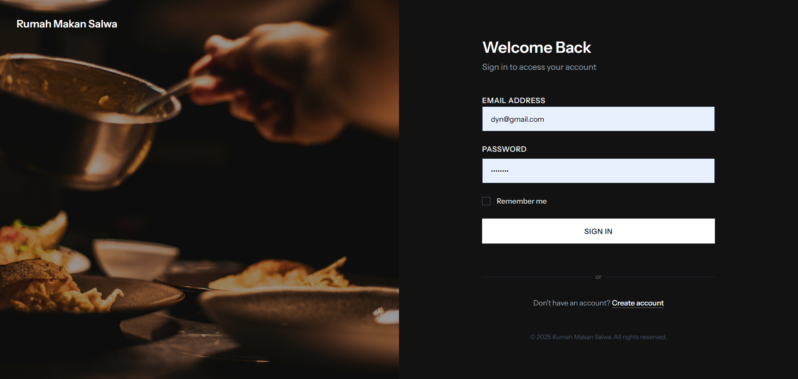

# Laporan Progres Mingguan - SORA
**Kelompok** : 6

**Mitra** : Rumah Makan Salwa

**Pekan ke -** : 12

**Tanggal** : 01/05/2025

---
## Anggota Kelompok ##

- **Amazia Devid Saputra dengan NIM 10231013** 
- **Dyno Fadillah Ramadhani dengan NIM 10231033**
- **Rani Ayu Dewi dengan NIM 10231079**
- **Siti Nur Azizah Putri Awni dengan NIM 10231087**

---

## Progress Summary
Minggu ini tim telah berhasil mengimplementasikan sistem manajemen restoran menggunakan Laravel Filament untuk backend dan React untuk frontend. Pencapaian utama meliputi:

1. **Multi-User Authentication System**
   - Implementasi 3 level user (Superadmin, Admin, Pelanggan)
   - Sistem login terpisah untuk masing-masing role
   - Keamanan route dan resource berdasarkan role

2. **Menu Management System**
   - CRUD operasi untuk menu makanan
   - Upload dan crop gambar menu
   - Manajemen stok realtime
   - Kategorisasi menu

3. **Customer Management**
   - Registrasi dan manajemen pelanggan
   - Profile photo management
   - Riwayat pemesanan pelanggan
   - Validasi data pelanggan

4. **Payment & Contact Information Management**
   - Manajemen rekening bank untuk pembayaran
   - Penandaan rekening bank utama (primary)
   - Manajemen nomor WhatsApp untuk kontak
   - Penandaan nomor WhatsApp utama (primary)

## Accomplished Tasks
1. **Backend Development (Laravel Filament)**
   - Implementasi AdminPanelProvider dan SuperAdminPanelProvider
   - Konfigurasi middleware authentication untuk tiap panel
   - Resource management (Menu, Pelanggan, Cart)
   - File upload system dengan disk public
   - Resource management untuk BankAccount dan WhatsappNumber

2. **Frontend Development (React)**
   - Halaman login/register responsif
   - Komponen menu dengan fitur filter dan search
   - Shopping cart dengan state management
   - Integrasi API dengan axios
   - Implementasi tampilan rekening bank di halaman pembayaran
   - Implementasi nomor WhatsApp di halaman reservasi

3. **Database & API**
   - Migrasi database untuk semua entitas
   - API endpoints untuk autentikasi dan operasi CRUD
   - Relasi antar tabel (foreign keys)
   - Data seeding untuk testing
   - Migrasi untuk tabel bank_accounts dan whatsapp_numbers

## Challenges & Solutions
1. **Multi-Panel Authentication**
   - **Challenge**: Mengatur akses berbeda untuk Superadmin dan Admin
   - **Solution**: Implementasi guard terpisah dan middleware custom
   ```php
   public static function canAccess(): bool
   {
       return Auth::guard('superadmin')->check();
   }
   ```

2. **File Upload Management**
   - **Challenge**: Handling berbagai jenis file dan ukuran
   - **Solution**: Konfigurasi disk storage dan image processing
   ```php
   Forms\Components\FileUpload::make('gambar')
       ->image()
       ->disk('public')
       ->directory('menu-photos')
       ->imageEditor()
       ->imageResizeMode('cover')
   ```

3. **State Management**
   - **Challenge**: Sinkronisasi state cart dengan backend
   - **Solution**: Implementasi React Context dan local storage
   ```javascript
   const CartContext = createContext();
   const CartProvider = ({ children }) => {
     const [cart, setCart] = useState([]);
     // Implementation
   };
   ```

4. **Bank Account & WhatsApp Number Management**
   - **Challenge**: Mengelola multiple rekening bank dan nomor WhatsApp dengan penandaan primary
   - **Solution**: Implementasi model terpisah dengan field is_primary dan integrasi dengan frontend
   ```php
   // Di controller
   $bankAccounts = BankAccount::all();
   $whatsappNumber = WhatsappNumber::where('is_primary', true)->first();
   
   // Di frontend
   const sortedBankAccounts = [...bankAccounts].sort((a, b) => {
     if (a.is_primary && !b.is_primary) return -1;
     if (!a.is_primary && b.is_primary) return 1;
     return 0;
   });
   ```

## Next Week Plan
1. **Email Notification System**
   - Implementasi notifikasi email untuk konfirmasi reservasi
   - Penambahan fitur pembatalan reservasi via email
   - Integrasi dengan sistem antrian dan notifikasi email

2. **Admin Dashboard Development**
   - Implementasi dashboard analytics untuk monitoring penjualan
   - Grafik trend penjualan harian/mingguan/bulanan
   - Manajemen laporan keuangan sederhana


## Contributions
- **Amazia Devid Saputra**: 
  - Frontend development (React components)
  - API integration
  - State management implementation

- **Dyno Fadillah Ramadhani**: 
  - Backend architecture
  - Filament panel configuration
  - Resource implementation
  - Authentication system

- **Rani Ayu Dewi**: 
  - UI/UX design
  - Frontend routing
  - Component styling
  - API documentation

- **Siti Nur Azizah Putri Awni**: 
  - Database design
  - API development
  - Testing implementation
  - Documentation

## Screenshots / Demo
## 1. Core Feature #2 & #3

### Fitur Reservasi
Fitur reservasi memungkinkan pelanggan untuk melakukan pemesanan meja di restoran secara online. Berikut adalah implementasi dan tampilan fitur reservasi:


Fitur-fitur yang tersedia dalam reservasi:
- Pemilihan tanggal dan waktu reservasi
- Input jumlah tamu
- Pemilihan meja yang tersedia
- Konfirmasi reservasi melalui email
- Status reservasi (pending, confirmed, cancelled)

### Fitur Cart
Fitur cart memungkinkan pelanggan untuk menambahkan menu ke keranjang belanja sebelum melakukan pemesanan. Berikut adalah implementasi dan tampilan fitur cart:


Fitur-fitur yang tersedia dalam cart:
- Penambahan menu ke keranjang
- Pengubahan jumlah item
- Penghapusan item dari keranjang
- Kalkulasi total harga
- Proses checkout

---

## 2. UI Enhancement

### Halaman Login
   
Halaman login menampilkan form autentikasi dengan desain minimalis dan modern. Terdapat field untuk input email dan password, serta tombol "Login" yang menonjol dengan warna primer. Di bagian bawah terdapat link untuk registrasi bagi pengguna baru.

### Halaman Registrasi

Halaman registrasi menyediakan form pendaftaran dengan field lengkap seperti nama lengkap, email, password, dan konfirmasi password. Form didesain dengan validasi real-time dan feedback visual untuk memastikan data yang dimasukkan valid.

### Halaman Beranda

Halaman beranda menampilkan hero section dengan gambar restoran yang menarik, diikuti dengan section promosi menu spesial. Terdapat juga section testimonial pelanggan dan informasi kontak restoran. Navigasi utama berada di bagian atas dengan menu-menu penting.

### Halaman Menu

Halaman menu menampilkan katalog menu dalam format grid dengan gambar menu yang menarik. Setiap item menu menampilkan nama, harga, dan deskripsi singkat. Terdapat filter berdasarkan kategori dan fitur pencarian untuk memudahkan pelanggan menemukan menu yang diinginkan.

### Halaman Pembayaran

Halaman pembayaran menampilkan ringkasan pesanan, total pembayaran, dan form input data pembayaran. Terdapat opsi metode pembayaran yang tersedia dan instruksi pembayaran yang jelas. Tombol konfirmasi pembayaran berada di bagian bawah halaman.

### Halaman Sukses Pembayaran

Halaman sukses pembayaran menampilkan konfirmasi visual dengan ikon centang besar dan pesan sukses. Terdapat detail transaksi dan nomor order untuk referensi. Tombol untuk kembali ke beranda dan melihat status pesanan tersedia di bagian bawah.

### Halaman Reservasi

Halaman reservasi menyediakan form pemesanan meja dengan kalender interaktif untuk pemilihan tanggal. Terdapat field untuk jumlah tamu, waktu reservasi, dan catatan khusus. Tampilan meja tersedia dalam format visual untuk memudahkan pemilihan.

### Halaman Tentang Kami

Halaman tentang kami menampilkan sejarah restoran, visi dan misi, serta tim pengelola. Desain menggunakan layout yang bersih dengan gambar-gambar yang relevan. Terdapat juga section testimonial dan prestasi restoran.

### Halaman Profil

Halaman profil menampilkan informasi pribadi pengguna, riwayat pesanan, dan pengaturan akun. Terdapat opsi untuk mengedit profil, mengubah password, dan mengelola preferensi notifikasi. Riwayat transaksi ditampilkan dalam format tabel yang rapi.

---

## 3. Unit Test: Minimal 3 test case untuk fungsi-fungsi penting

### Test Menu Management
Implementasi unit test untuk manajemen menu:


Test case yang diimplementasikan:
- Penambahan menu baru
- Pengubahan informasi menu
- Penghapusan menu
- Validasi input menu

### Test Cart Functionality
Implementasi unit test untuk fungsi cart:


Test case yang diimplementasikan:
- Penambahan item ke cart
- Update quantity item
- Penghapusan item
- Kalkulasi total harga

### Test Reservation System
Implementasi unit test untuk sistem reservasi:


Test case yang diimplementasikan:
- Pembuatan reservasi baru
- Validasi ketersediaan meja
- Pembatalan reservasi
- Update status reservasi

### Test WhatsApp Integration
Implementasi unit test untuk integrasi WhatsApp:


Test case yang diimplementasikan:
- Pengaturan nomor WhatsApp utama
- Validasi format nomor
- Pengiriman notifikasi
- Manajemen multiple nomor

---

Link Github Repository untuk website : https://github.com/brosora6/sora.git

Link Github Repository untuk Laporan : https://github.com/justdyn/laporan_proweb.git