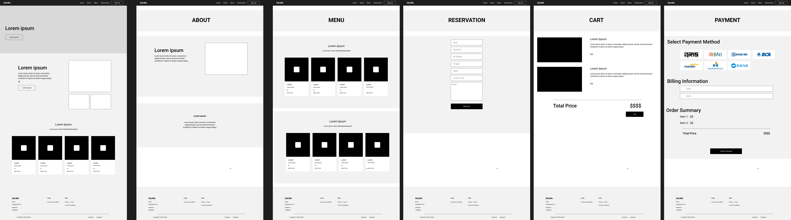
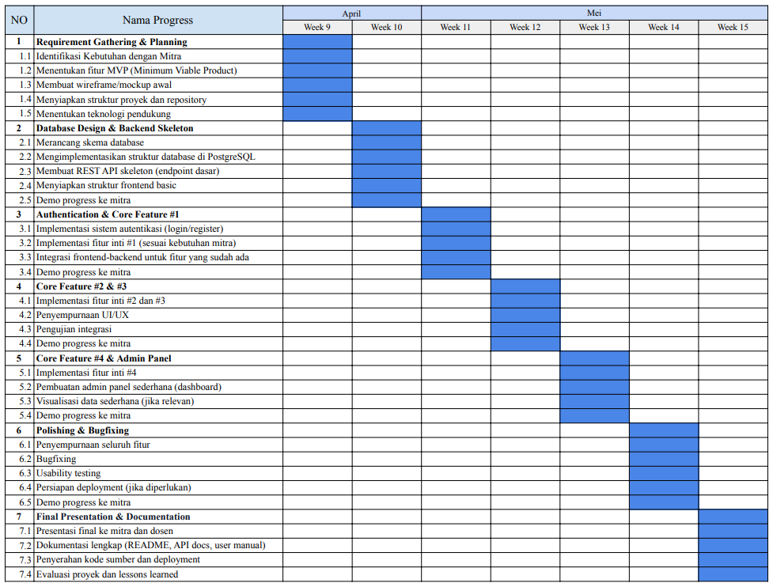

### Tugas 9 
### Nama	    : Amazia Devid Saputra
### NIM	        : 10231013
### Kelompok    : 6

## 1. Deksripsi Kebutuhan Mitra
Rumah Makan Salwa, sebuah establishmen kuliner yang telah melayani pelanggan setianya selama bertahun-tahun, kini menghadapi tantangan di era digital. Dalam upaya modernisasi layanan dan peningkatan pengalaman pelanggan, Rumah Makan Salwa membutuhkan sebuah platform digital yang komprehensif. Saat ini, proses reservasi masih dilakukan secara manual menggunakan buku catatan yang rentan terhadap kesalahan manusia dan terbatas dalam hal aksesibilitas. Pengelolaan pesanan juga menjadi tantangan tersendiri, terutama saat restoran sedang ramai pengunjung, yang dapat menyebabkan keterlambatan layanan dan potensi kesalahan pencatatan pesanan. Keterbatasan metode pembayaran yang hanya menerima uang tunai juga menghambat kenyamanan pelanggan yang lebih memilih bertransaksi secara digital.

Untuk mengatasi tantangan tersebut, Rumah Makan Salwa membutuhkan sistem website yang mengintegrasikan berbagai fitur esensial. Pertama, sistem reservasi online yang memungkinkan pelanggan memesan meja dari mana saja dan kapan saja, dengan konfirmasi otomatis dan manajemen ketersediaan meja yang real-time. Kedua, platform pemesanan makanan digital yang memungkinkan pelanggan menjelajahi menu dengan detail lengkap, melakukan pemesanan, dan melacak status pesanan mereka. Ketiga, sistem pembayaran yang terintegrasi dengan multiple channel, termasuk transfer bank dan DANA, untuk memberikan fleksibilitas dalam bertransaksi. Sistem ini juga akan dilengkapi dengan autentikasi pengguna untuk memastikan keamanan transaksi dan memungkinkan pelanggan memiliki akun personal yang menyimpan riwayat pesanan dan preferensi mereka.

Dengan implementasi sistem ini, Rumah Makan Salwa berharap dapat meningkatkan efisiensi operasional secara signifikan, memberikan pengalaman pelanggan yang lebih baik, dan pada akhirnya mendorong pertumbuhan bisnis. Sistem ini akan membantu restoran dalam mengumpulkan data pelanggan yang berharga untuk pengembangan layanan di masa depan, serta memungkinkan manajemen yang lebih baik dalam hal inventori, pesanan, dan reservasi. Modernisasi ini diharapkan dapat memposisikan Rumah Makan Salwa sebagai restoran yang adaptif terhadap kebutuhan pelanggan di era digital, sambil tetap mempertahankan kualitas makanan dan layanan yang telah menjadi ciri khas mereka.

---

## 2. Fitur-Fitur MVP (Minium Viable Product)
#### 2.1. Home Page (`/`)
- Menampilkan selamat datang
- Navigasi ke Menu, Reservasi, Keranjang, dan Pembayaran

#### 2.2. Menu Makanan (`/menu`)
- Menampilkan daftar makanan dan minuman
- Setiap item memiliki nama, harga, dan tombol "Tambah ke Keranjang"

#### 2.3. Keranjang Belanja (`/cart`)
- Menampilkan item yang telah dipilih
- Fitur hapus item dari keranjang
- Tombol lanjut ke pembayaran

#### 2.4. Reservasi Meja (`/reservation`)
- Form input: nama, tanggal, jam, jumlah orang
- Tombol "Reservasi"
- Data disimpan ke database

#### 2.5. Pembayaran (`/payment`)
- Menampilkan total belanja dari keranjang
- Tombol simulasi pembayaran
- Data pesanan disimpan ke database

#### 2.6. Halaman Admin (opsional) (`/admin`)
- Melihat daftar reservasi
- Melihat daftar pesanan
- CRUD menu makanan (opsional)

---

## 3. Struktur Database Sederhana

#### Tabel `menus`
| Field | Tipe | Keterangan |
|-------|------|------------|
| id | INT (PK) | ID menu |
| name | VARCHAR | Nama menu |
| price | INT | Harga menu |

#### Tabel `cart`
| Field | Tipe | Keterangan |
|-------|------|------------|
| id | INT (PK) | ID keranjang |
| user_id | INT (FK) | ID pengguna |
| menu_id | INT (FK) | ID menu |
| quantity | INT | Jumlah item |
| created_at | DATETIME | Waktu penambahan ke keranjang |
| updated_at | DATETIME | Waktu pembaruan keranjang |

#### Tabel `reservations`
| Field | Tipe | Keterangan |
|-------|------|------------|
| id | INT (PK) | ID reservasi |
| name | VARCHAR | Nama pelanggan |
| date | DATE | Tanggal reservasi |
| time | TIME | Jam reservasi |
| people | INT | Jumlah orang |

#### Tabel `orders`
| Field | Tipe | Keterangan |
|-------|------|------------|
| id | INT (PK) | ID pesanan |
| items | TEXT | JSON/Serialized item |
| total_price | INT | Total harga |
| created_at | DATETIME | Waktu pemesanan |

#### Tabel `users`
| Field | Tipe | Keterangan |
|-------|------|------------|
| id | INT (PK) | ID pengguna |
| name | VARCHAR | Nama pengguna |
| email | VARCHAR | Email pengguna |
| password | VARCHAR | Password terenkripsi |
| role | ENUM | 'superadmin', 'admin', 'customer' |
| created_at | DATETIME | Waktu pembuatan akun |
| updated_at | DATETIME | Waktu pembaruan akun |

#### Tabel `roles_permissions`
| Field | Tipe | Keterangan |
|-------|------|------------|
| id | INT (PK) | ID hak akses |
| role_name | VARCHAR | Nama peran |
| permissions | TEXT | JSON hak akses |

#### Deskripsi Peran Pengguna

##### SuperAdmin
- Mengatur akses user
- Manajemen menu (CRUD)
- Manajemen reservasi
- Manajemen pesanan
- Manajemen pembayaran
- Manajemen user (CRUD)

##### Admin
- Manajemen menu (CRUD)
- Manajemen reservasi
- Manajemen pesanan
- Manajemen pembayaran

##### Pelanggan
- Melihat menu
- Memasukkan menu ke keranjang belanja
- Membuat reservasi meja
- Melakukan pembayaran pesanan

---

## 4. Teknologi yang Digunakan
- Frontend: React Inertia
- Backend: Laravel 12 with Filament 
- Database: PostgreSQL

#### Alasan Penggunaan JSON untuk Penyimpanan Data

Beberapa field dalam database menggunakan format JSON untuk penyimpanan data (seperti pada `items` di tabel `orders` dan `permissions` di tabel `roles_permissions`) karena:

1. **Fleksibilitas**: Format JSON memungkinkan penyimpanan data yang terstruktur namun dapat berubah-ubah tanpa perlu mengubah skema database.

2. **Kompleksitas Data**: Struktur keranjang belanja dan pesanan memiliki struktur bersarang yang dapat lebih efisien disimpan sebagai JSON.

3. **Query Kemampuan**: PostgreSQL mendukung pencarian dan pengindeksan pada data JSON, sehingga memungkinkan query yang kompleks.

4. **Efisiensi Pengembangan**: Menyimpan data dalam format JSON dapat mempercepat proses pengembangan tanpa mengorbankan kinerja.

#### Kompabilitas Laravel 12 dengan React Inertia dan Filament

Penggunaan kombinasi Laravel 12, React Inertia, dan Filament sangat mendukung pengimplementasian struktur database yang menggunakan JSON:

1. **Laravel 12 dan JSON**: Laravel memiliki dukungan native untuk menangani kolom JSON dengan Eloquent melalui casting attributes. Field yang disimpan sebagai JSON dapat diakses sebagai array atau objek PHP dan secara otomatis dikonversi saat disimpan ke database.

2. **React Inertia dan Data Transfer**: React Inertia mempermudah pengiriman data dari backend Laravel ke frontend React. Data dalam format JSON dapat ditransfer tanpa perlu transformasi tambahan, karena React secara alami bekerja dengan struktur data JSON.

3. **Filament dan Panel Admin**: Filament mendukung penuh manipulasi data JSON dalam formulir dan tampilan admin. Panel admin dapat dikonfigurasi untuk mengedit struktur JSON secara visual melalui form builder atau JSON editor.

4. **Performa**: PostgreSQL, Laravel, dan React semuanya memiliki optimasi untuk bekerja dengan data JSON, sehingga tidak akan ada masalah performa berarti jika diimplementasikan dengan benar.

5. **Developer Experience**: Kombinasi teknologi ini memungkinkan developer untuk bekerja dengan format data yang konsisten (JSON) di seluruh stack, dari database hingga frontend, yang meningkatkan efisiensi dan mengurangi kesalahan.

---

## 5. Wireframe

Wireframe menampilkan rancangan antarmuka yang komprehensif untuk website Rumah Makan Salwa. Desain ini terdiri dari enam halaman utama yang saling terhubung:

- **Halaman Beranda**: Tampilan awal yang minimalis dengan teks pembuka dan elemen navigasi utama.
- **Halaman About**: Memperkenalkan informasi tentang restoran dengan layout yang informatif dan deskriptif.
- **Halaman Menu**: Menampilkan berbagai pilihan makanan dalam bentuk grid gambar yang menarik, memudahkan pelanggan untuk melihat dan memilih hidangan.
- **Halaman Reservasi**: Dilengkapi dengan formulir pemesanan meja yang intuitif untuk mengumpulkan data pelanggan.
- **Halaman Keranjang**: Menampilkan item yang telah dipilih beserta total harga dan opsi untuk melanjutkan ke pembayaran.
- **Halaman Pembayaran**: Menyediakan berbagai metode pembayaran dengan tampilan yang terstruktur, informasi penagihan, dan ringkasan pesanan.

---

## 6. Timeline

Timeline pada gambar menggambarkan rencana pengembangan selama tujuh minggu, mulai dari Minggu ke-9 hingga Minggu ke-15. Timeline dibagi menjadi tujuh fase utama:

1. **Pengumpulan Kebutuhan & Perencanaan** (Minggu 9): Fokus pada identifikasi kebutuhan dengan mitra, penentuan fitur MVP, pembuatan wireframe, penyiapan struktur proyek, dan penentuan teknologi pendukung.

2. **Desain Database & Kerangka Backend** (Minggu 10): Meliputi perancangan skema database, implementasi struktur database di PostgreSQL, pembuatan REST API skeleton, dan penyiapan struktur frontend dasar.

3. **Autentikasi & Fitur Utama #1** (Minggu 11): Pengembangan sistem autentikasi, implementasi fitur inti pertama, dan integrasi frontend-backend.

4. **Fitur Utama #2 & #3** (Minggu 12): Implementasi fitur inti kedua dan ketiga, penyempurnaan UI/UX, dan pengujian integrasi.

5. **Fitur Utama #4 & Panel Admin** (Minggu 13): Implementasi fitur inti keempat, pembuatan admin panel sederhana, dan visualisasi data.

6. **Penyempurnaan & Perbaikan Bug** (Minggu 14): Penyempurnaan seluruh fitur, bugfixing, usability testing, dan persiapan deployment.

7. **Presentasi Final & Dokumentasi** (Minggu 15): Presentasi final ke mitra dan dosen, dokumentasi lengkap, penyerahan kode sumber, dan evaluasi proyek.

---

## 7. Struktur Github Repository
```
salwa-restaurant/
├── app/
│   ├── Http/
│   │   ├── Controllers/
│   │   │   ├── MenuController.php
│   │   │   ├── ReservationController.php
│   │   │   ├── OrderController.php
│   │   │   └── PaymentController.php
│   │   └── Middleware/
│   ├── Models/
│   │   ├── Menu.php
│   │   ├── Reservation.php
│   │   └── Order.php
│   └── Filament/
│       └── Resources/
├── database/
│   ├── migrations/
│   │   ├── create_menus_table.php
│   │   ├── create_reservations_table.php
│   │   └── create_orders_table.php
│   └── seeders/
├── resources/
│   ├── js/
│   │   ├── Pages/
│   │   │   ├── Home/
│   │   │   ├── Menu/
│   │   │   ├── Cart/
│   │   │   ├── Reservation/
│   │   │   └── Payment/
│   │   ├── Components/
│   │   │   ├── Navigation.jsx
│   │   │   ├── MenuItem.jsx
│   │   │   └── ReservationForm.jsx
│   │   └── Layouts/
│   └── views/
├── routes/
│   └── web.php
├── public/
│   ├── images/
│   └── build/
├── tests/
│   ├── Feature/
│   └── Unit/
├── .env.example
├── .gitignore
├── composer.json
├── package.json
├── vite.config.js
└── README.md
```
Struktur ini mengorganisir kode berdasarkan:

1. **Backend (Laravel)**
   - `app/`: Logic utama aplikasi
   - `database/`: Migrasi dan seeder
   - `routes/`: Definisi routing

2. **Frontend (React Inertia)**
   - `resources/js/`: Komponen React
   - `resources/js/Pages/`: Halaman utama
   - `resources/js/Components/`: Komponen reusable

3. **Asset & Config**
   - `public/`: Asset statis
   - `tests/`: Unit dan feature tests
   - File konfigurasi (`.env`, `composer.json`, dll)

4. **Filament Admin**
   - `app/Filament/`: Resource dan konfigurasi admin panel

---

Link Github Repository untuk website : https://github.com/brosora6/sora.git

Link Github Repository untuk Laporan https://github.com/justdyn/laporan_proweb.git